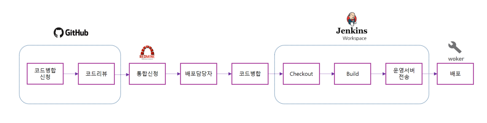

# 배포 프로세스

## 소개
이 문서는 CI/CD 통한 배포 프로세스 설명을 담고 있습니다.

## CI/CD?
여러 명의 개발자가 개발한 소스를 지속적으로 하나로 통합하는 것을 ‘지속적 통합’(Continuous Integration)이라 하고 줄여서 CI라고 합니다. 빌드 결과물을 지속적으로 전달하여 제품의 질적 향상을 꾀하는 것을 ‘지속적 전달’(Continuous Delivery)이라 하고 줄여서 CD라고 합니다. CI/CD를 하는 이유는 다음과 같습니다.

- 코드 통합 시 생기는 문제점을 사전에 발견하여 처리
- 빌드 형상 관리
- 담당자가 아닌 사람도 쉽게 빌드 가능
- 개발자가 개발에만 집중할 수 있다.
- 자주 배포하여 자주 피드백을 얻는 개발 프로세스를 가능하다.

## 버전관리
- Github
> 

## CI/CD Tool
현재 티쿤에서는 두 가지 tool을 사용하여 지속적인 통합 및 지속적인 배포를 진행하고 있습니다.

|  | CruiseControl | Jenkins |
| --- | --- | --- | 
| 주소 | <http://cruisecontrol.sourceforge.net/> | <https://www.jenkins.io/> |
| 사용용도 | 배포, 사이트 생성, 워커 | 배포, 자동 하향 병합 |

## 배포 전체 흐름

#### 코드병합신청
> github를 PullRequest 코드를 병합을 진행하고 주소를 레드마인 이슈에 기재한다.

#### 코드리뷰
> 레드마인 주소를 아지트(카카오)에 등록하여 코드리뷰를 요청한다.

#### 통합신청
> 레드마인 이슈에서 진행단계를 "통합신청"으로 변경한다.

#### 배포담당자
> 배포담당자는 레드마인에 등록된 통합신청 이슈들을 확인한다.

#### 코드병합
> 통합신청이 완료된 브랜치들을 master 브랜치에 병합한다.

####  CheckOut
> Master 브랜치 커밋 이벤트를 확인하여 필요한 프로젝트을 CheckOut 한다.

#### Build
> MSBuild, Nuget을 실행하여 빌드 작업을 수행한다.

#### 운영서버 전송
> 빌드가 완료된 파일들을 운영서버에 Rsync 사용하여 복사한다.

#### 배포
> iis 설정 및 파일 복사를 실행한다.
