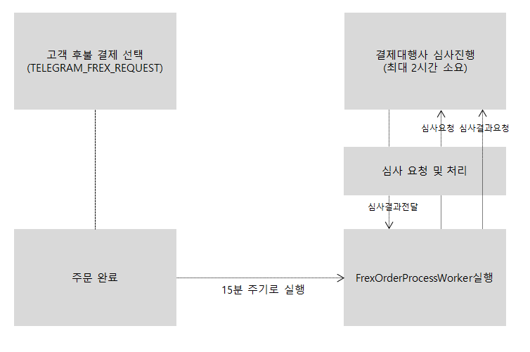

# 신용 결제 프로세스

신용 결제 서비스는 전문 대행 업체를 통해 기업 간 결제 서비스인 FREX B2B 후불 결제 서비스를 이용합니다.
후불 결제 심사는 FrexOrderProcessWoker 워커로 동작하며 전문 대행 업체(NP사)에 심사 요청, 처리를 진행합니다.



고객이 주문페이지에서 신용 결제에  필요한 추가 정보를 입력 받아 주문을 완료합니다.
주문 완료 된 신용 결제 주문은 일정한 시간 간격으로 FrexOrderProcessWoker가 실행되어 신용결제사에 고객이 입력한 정보 토대로 심사를 요청합니다. 
신용 결제사는 심사 후 결과를 전달하고, 전달 받은 결과로 결제 처리 및 취소를 진행합니다. 


### 신용 결제 추가
 신용 결제는 joiner 테이블에 UseFrex 칼럼으로 결제 사용 유무를 판단합니다 . (사용 안할 경우 0, 사용 할 경우 1)
 신용 결제 추가 시 joiner 테이블의 UserFrex를 1로 업데이트 하여야 합니다.

### 신용 결제 주문단계 

>> 최초 주문 등록 시 TELEGRAM_FREX_REQUEST, SBPAYMENT 주문 상태로 등록이 되며, 신용결제워커를 통해 심사 후 결과를 통해 주문 단계가 업데이트 됩니다.

| tblOrder 테이블 컬럼 | 주문완료 | 심사완료 | 주문취소
| strstate | REG |REG|DEL
| strOrderState |  ACCEPT |ACCEPT / ORDEREND | 관련없음
| strMoneyInput | SBPAYMENT |TEMPPAYMENT / PAYMENT | 관련없음
| strPayType | TELEGRAM_FREX_REQUEST | TELEGRAM_FREX_REQUEST |TELEGRAM_FREX_REQUEST


### 신용결제워커(FrexOrderProcessWoker)
 신용 결제 워커가 동작하여 주문 등록 , 주문 수정, 주문 취소, 주문 심사, 주문 청구를 진행합니다.


``` C# 
  public void Batch()
        {
            OrderResult(); //주문 등록 결과 처리
            OrderReg(); //주문 등록 처리

            UpdateResult(); //수정 결과 처리
            UpdateReg(); //수정 등록 처리

            DeleteResult(); //삭제 결과 처리
            DeleteReg(); //삭제 등록 처리

            AuthorizeResult(); //심사 결과 처리

            BillingResult(); //청구 결과 처리
            BillingReg() //청구 등록 처리
         }
```
---
 - RequestRegistService : 주문건을 ccnet단계별 STANDBY 상태로 FrexRequest테이블 INSERT
 - RequestTransService : 단계별 STANDBY 상태 주문 FrexRequest 테이블 검색
 - ResponseProcService : FrexRequest request,reponse 요청 및 응답, 완료 되면 상태 COMPLETE 상태로 UPDATE ,실패건들 알림 처리


|단계|내용|
|RequestRegistService.OrderReg();| 신용 결제 접수 대상을 조회 , TELEGRAM_FREX_REQUEST,SBPAYMENT이고 FrexStateInfo테이블에 없는 주문
|RequestTransService.OrderReg(); | 신용 결제 접수 처리, 접수번호 (AcceptNo) 갱신
|RequestRegistService.OrderResult(); | 신용 결제 접수 결과 요청
|RequestTransService.OrderResult(); | 신용 결제 접수 결과 응답,npTransacionId 부여 
|RequestRegistService.UpdateReg(); |  대상 조회 , billedAmount 값이 주문결과의 orderCompleteAmount와 다를때 실행, accetedId 거래 수정 대기
|RequestTransService.UpdateReg();|accetedId 거래 수정 접수
|RequestRegistService.UpdateResult();|거래 수정 접수 결과 조회
|RequestTransService.UpdateResult();| 거래 수정 접수 결과 처리
|RequestRegistService.DeleteReg();|주문 취소 대상 조회
|RequestTransService.DeleteReg();|주문 취소 대상 처리
|RequestRegistService.DeleteResult();|주문 취소 결과 대상 조회
|RequestTransService.DeleteResult(); | 주문 취소 결과 대상 처리
|RequestRegistService.AuthorizeResult();| 주문 심사 결과 조회
|RequestTransService.AuthorizeResult();| 주문 심사 결과 처리
|RequestRegistService.BillingReg();| 주문 청구 대상 조회
|RequestTransService.BillingReg();| 주문 청구 대상 처리
|RequestRegistService.BillingResult();| 주문 청구 결과 대상 조회
|RequestTransService.BillingResult();| 주문 청구 결과 대상 처리

  
* FrexStateInfo

|단계|데이터 조작|npTransactionId|acceptNo|regState|resultState|strState|billingState|authorizeState
|RequestRegistService.OrderReg() |insert | '' | ''|STANDBY|ORDER||NONE
|RequestRegistService.OrderResult(); |select| '0' or '' | <> ''|STANDBY|ORDER|REG
|RequestRegistService.UpdateReg(); |update| 변경사항없음|변경사항없음|변경사항없음|UPDATE
|RequestRegistService.UpdateResult();|select| <> '0' , <> '' | <> '' | COMPLETE | UPDATE | REG
|RequestRegistService.DeleteReg();|Update|변경사항없음|변경사항없음|변경사항없음|DELETE
|RequestRegistService.DeleteResult();|select|<> '0' , <> '' | <> '' | COMPLETE | DELETE  | DEL
|RequestRegistService.AuthorizeResult();|select| || COMPLETE| <>'CANCEL' |  <>'DEL'||NONE,DELAY
|RequestRegistService.BillingReg();|Update||COMPLETE|COMPLETE|<> 'DEL'||NONE|COMPLETE
|RequestRegistService.BillingResult();|select| <> '0' , <> '' |<> ''|COMPLETE|BILLING||STANDBY


 * FrexRequest
 
|단계| State |Type|Response
|RequestRegistService.OrderReg() |STANDBY | ORDER_REG |접수대기
|RequestTransService.OrderReg()|COMPLETE | ORDER_REG |접수완료
|RequestRegistService.OrderResult();|STANBY|ORDER_RESULT|접수결과요청
|RequestTransService.OrderResult();| COEMPLETE|ORDER_RESULT|접수결응답
|RquestRegistService.UpdateReg();| STANDBY|UPDATE_REG|거래수정요청
|RequestTransService.UpdateReg();|COMPLETE|UPDATE_REG|거래수정완료
|RequestRegistService.UpdateResult();| STANDBY|UPDATE_RESULT|거래수정결과요청
|RequestTransService.UpdateResult();| COMPLETE | UPDATE_RESULT|거래수정결과응답
|RequestRegistService.DeleteReg();|STANDBY|DELETE_REG|거래취소요청
|RequestTransService.DeleteReg();|COMPLETE|DELETE_REG|거래취소완료
|RequestRegistService.DeleteResult();|STNADBY|DELETE_RESULT|거래취소결과요청
|RequestTransService.DeleteResult();|COMPLETE|DELETE_RESULT|거래취소결과응답
|RequestRegistService.AuthorizeResult();|STANDBY|AUTHORIZE_RESULT|심사요청
|RequestTransService.AuthorizeResult();|COMPLETE|AUTHORIZE_RESULT|심사완료
|RequestRegistService.BillingReg();|STNADBY|BILLING_REG|청구대상요청
|RequestTransService.BillingReg();|COMPLETE|BILLING_REG|청구완료
|RequestRegistService.BillingResult();|STANDBY|BILLING_RESULT|청구결과요청
|RequestTransService.BillingResult();|COMPLETE|BILLING_RESULT|청구결과응답


