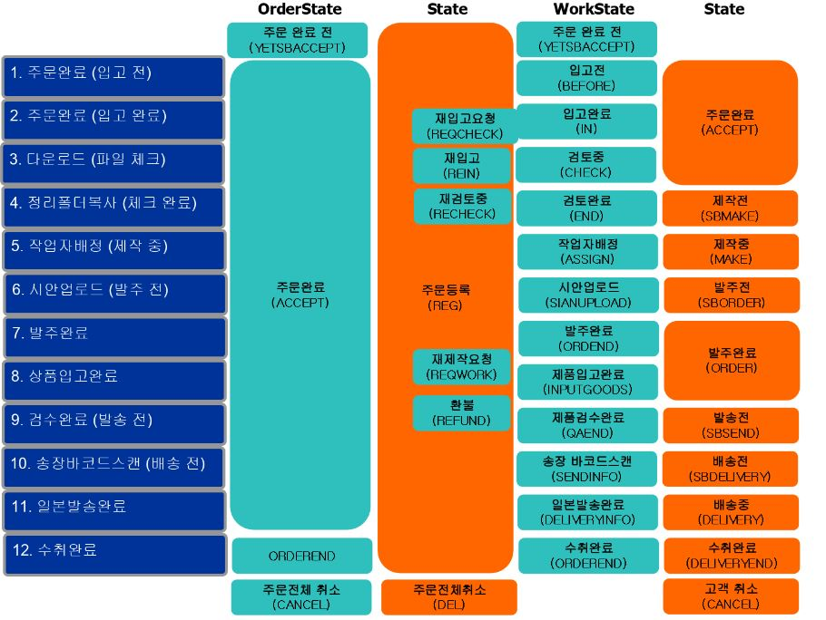

#  Adprint

Adprint는 인쇄, 사무, 판촉품 쇼핑 사이트로 베러웨이 (명함,스티커,위젯상품) , 트윈벨(전단지,책자) , 유패키지(박스)가 운영되고 있습니다.

---
>> 사이트 
 https://www.adrpint.jp

>> 관리자 페이지
 어드민2 > http://admin2.adprint.jp
 파트너 > http://partner.adprint.jp
 
>> 형상관리
  애드프린트 > https://github.com/TqoonDevTeam/AdprintWeb
  어드민2 > https://github.com/TqoonDevTeam/AdAdmin
  파트너 > https://github.com/TqoonDevTeam/Partner
  라이브러리 > https://github.com/TqoonDevTeam/TqoonLibraries

## 상품 유형
 상품은 admin2, partner, 위젯상품이 있습니다.

1. ADMIN2 상품 
tblGoods테이블의 partnerGoodsId컬럼 -  0 , null

2. PARTNER 상품 
tblGoods테이블의 partnerGoodsId컬럼이 0이 아닌 상품
 

3. 위젯 상품
 PartnerGoods의 goodsType이 WIDGET 상품

## 주문 페이지 유형
주문 페이지는 크게 3가지 유형이 있으며, 상품 유형에 따라 달라집니다.

1. TotalOrder.aspx 
 -  admin2 상품의 주문 페이지

2. /Product/Order
 -  Partner 상품의 주문 페이지

3. /Product/item
 - 위젯 상품의 주문페이지

## 백그라운드

>> CCNET
http://224.local.ccnet.com/ViewFarmReport.aspx

BankJnbCrwalerSet_{사이트명}  | 재팬넷 은행 전표 수집기
BankPostOfficeCrwalerSet_{사이트명} | 우쵸 은행 전표 수집기
BankSamjungCrwalerSet_{사이트명} | 미츠이 은행 전표 수집기
AdprintPdfConverter  | 발주 PDF 파일 > 고객 시안 생성 

>> 작업 스케쥴러

SianControl1 | 파일 발주 / 재주문 / 재제작 주문 관련 파일 이동 및 단계 처리
SianControl2 | 데이터 작성 서비스 / 파일 다운로드

## 주문 단계

 - CCNET 또는 스케쥴러로 224에서 실행
 - 검토 ~ 발주까지 워커에서 체크하여 자동으로 단계 이동 진행

 

 